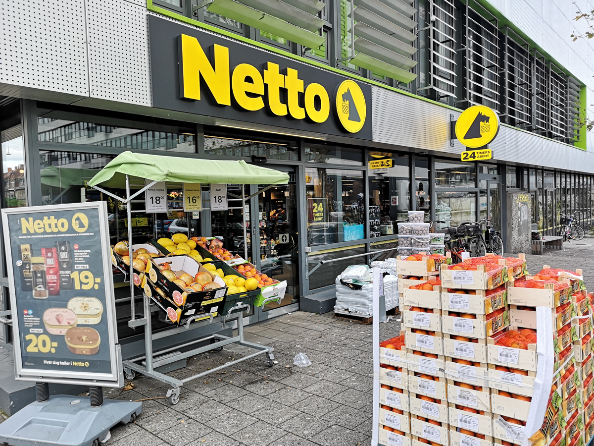
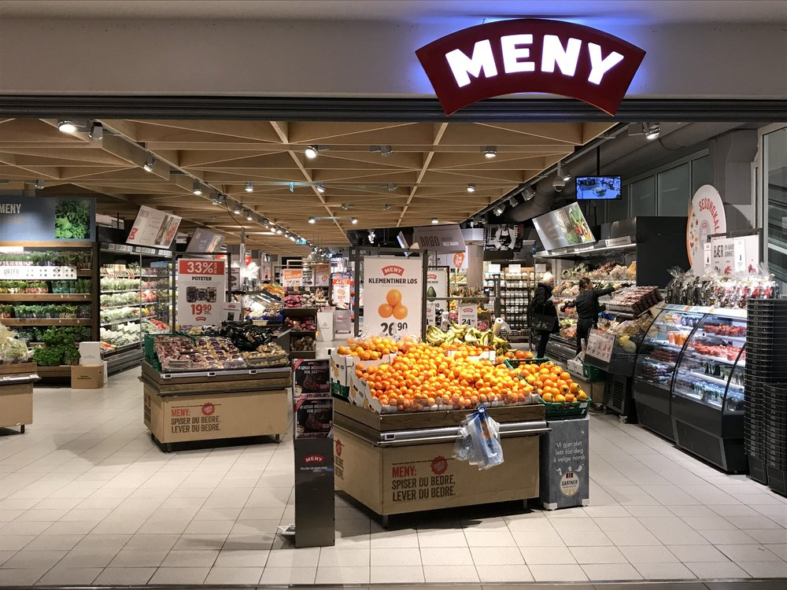
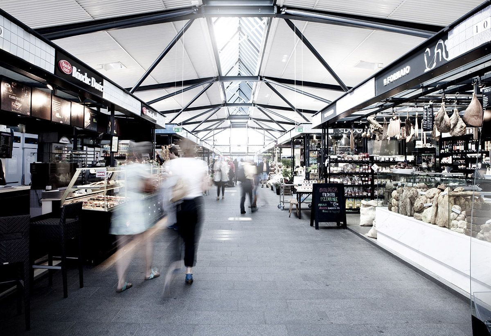

# Grocery shopping in Copenhagen

Copenhagen is full of a variety of different supermarkets. Some of them are quite cheap and offer basic goods while others have more pricey and extravagant products. Here we will give you a short overview of your options. Remember that there can also be quite some differences in the variety of goods and the supermarket's structure between branches of the same supermarket chain. 

## Discount supermarkets

There are several low-budget supermarkets that are ideal for everyday grocery shopping, e.g., Netto, Fakta, Lidl, and Aldi. Netto is probably the most frequent supermarket in Copenhagen. It's a Danish discounter, which offers basic goods at affordable prices. Fakta is similar to Netto, but less frequently distributed across the city. Lidl and Aldi are German supermarkets that have some German goods in their product range. Lidl branches can only be found in the suburbs of Copenhagen and not in the city center. Lidl has rotating special weeks in which they sell products from certain regions or cultures.

## Medium-priced supermarkets

If you like to get some higher quality food or certain brands, you should try one of the medium-priced supermarkets like Meny, Føtex, Superbrugsen, or Bilka (only in Amager). Here you can usually find a wide range of vegetables, a meat, fish, and cheese counter, as well as some special wines and beers. Especially Føtex can also be found all around Copenhagen.

## Pricey supermarkets

At Irma or Torvehallerne you will find the highest quality of food but it will also be quite expensive. Irma is in general comparable to other supermarkets but known for its gourmet products. Torvehallerne is in the city center and not a single supermarket but consists of several stands in a large venue. At Torvehallerne you cannot just get high quality ingredients but also extravagant snacks and meals.

